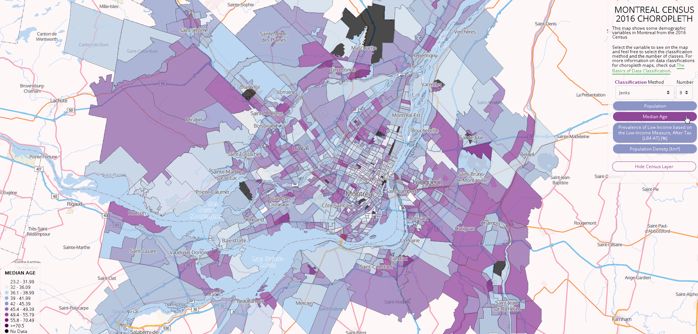

#Choropleth Map

This code provides a template for generating choropleth maps to visualize census demographic data at the Census Tract geographic boundary.

This is currently in development, so documentation will come.

But basically you will have to make changes in `javascript/config.js` to update the map's initialization and labels. You will also have to update the data to your geojson of interest in `javascript/data.js`.

**Data from Statistics Canada 2016 Census Profile Table**